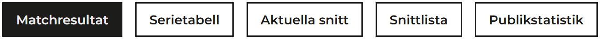
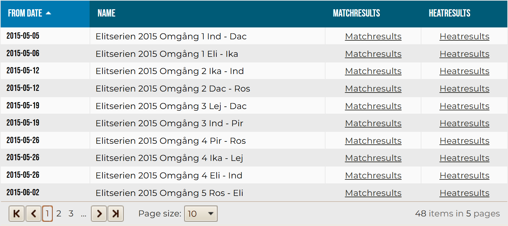
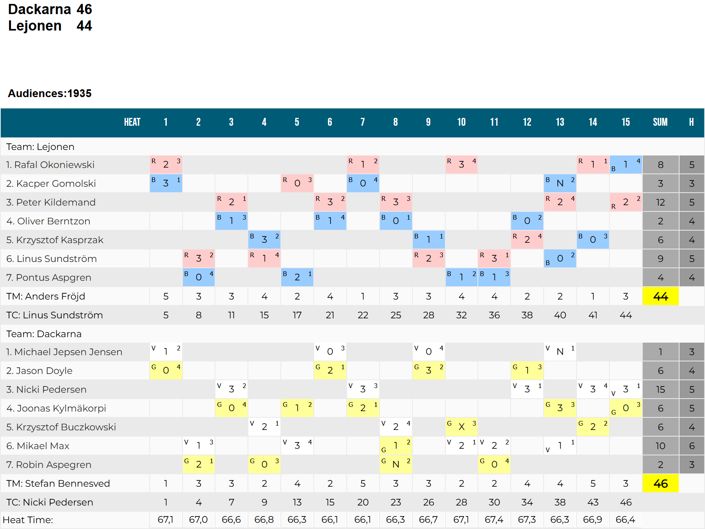
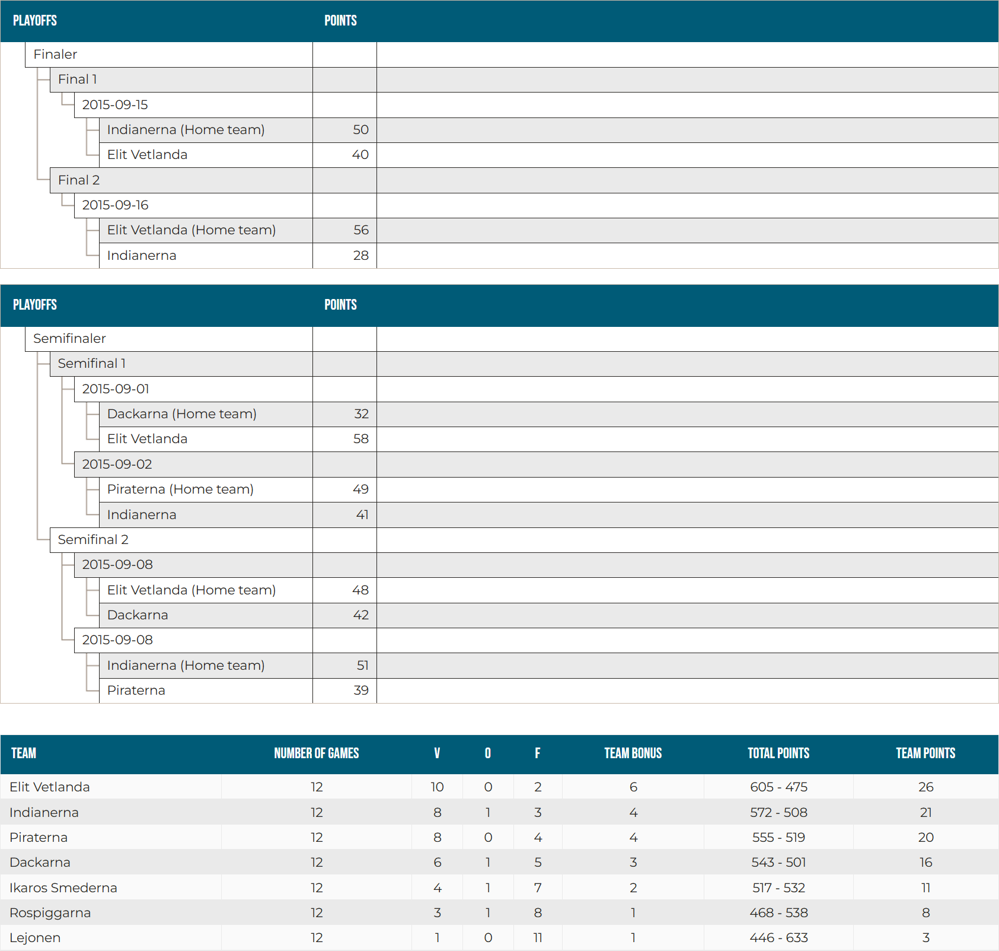
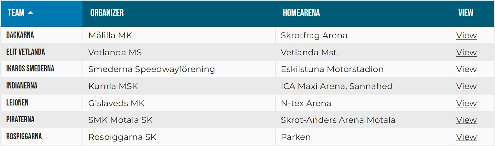
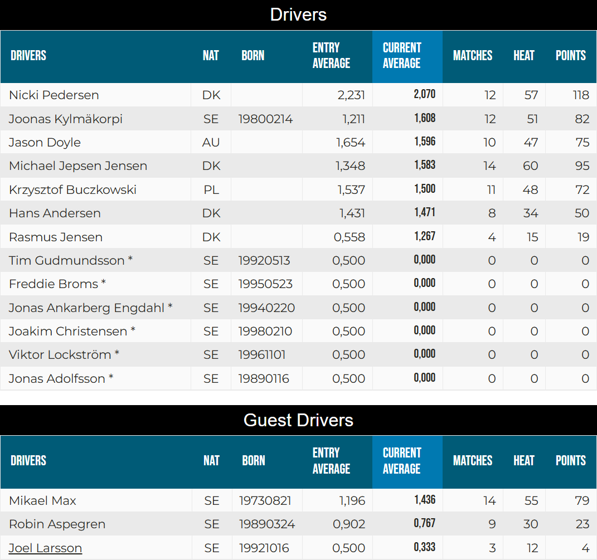
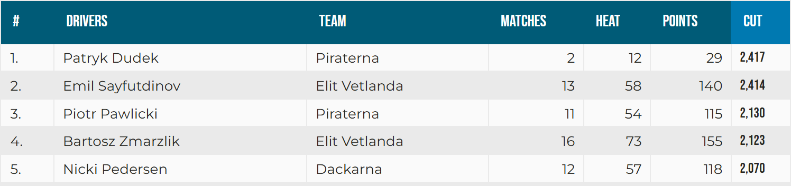
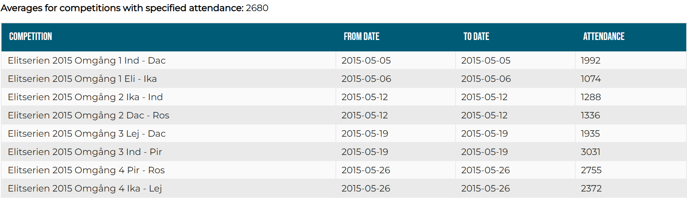

This section outlines the structure of the SVEMO website and the types of data available for scraping.

## Page Hierarchy

The tree below illustrates the hierarchy of pages from which the scraper navigates through and extracts data.

```plaintext
Home
├── Results
│   ├── Events
│   │   ├── Scorecard
│   │   └── ...
│   ├── Standings
│   ├── Teams
│   │   ├── Squad
│   │   └── ...
│   ├── Rider Averages
│   └── Attendance
├── Results
└── ...
```

---
## Results

Data is extracted from various [results](https://www.svemo.se/vara-sportgrenar/start-speedway/resultat-speedway/resultat-bauhausligan-speedway?language=en-us) pages, grouped by league and season. Each results page acts as a central hub, containing five tabs. Each tab displays data directly, links to subpages, or both.



The table below maps the SVEMO tab names to their corresponding API equivalents.

<table>
  <tbody>
    <tr>
      <td><b>SVEMO Tab</b></td>
      <td style="text-align: center">Matchresultat</td>
      <td style="text-align: center">Serietabell</td>
      <td style="text-align: center">Aktuella snitt</td>
      <td style="text-align: center">Snittlista</td>
      <td style="text-align: center">Publikstatistik</td>
    </tr>
    <tr>
      <td><b>API Equivalent</b></td>
      <td style="text-align: center">
        <a href=#events>Events</a>
      </td>
      <td style="text-align: center">
        <a href=#standings>Standings</a>
      </td>
      <td style="text-align: center">
        <a href=#teams>Teams</a>
      </td>
      <td style="text-align: center">
        <a href=#rider-averages>Rider Averages</a>
      </td>
      <td style="text-align: center">
        <a href=#attendance>Attendance</a>
      </td>
    </tr>
  </tbody>
</table>

---
## Data Pages

### Events

Embedded in the first tab. Contains a table listing basic event details and provides links to [scorecard](#scorecard) and [heat results](#heat-results) pages containing detailed match data.



#### Scorecard

Accessible via links in the third column of an **events** table. Contains a division displaying full team names and scores, a paragraph displaying the attendance figure, and a table (scorecard) displaying heat-specific statistics.



#### Heat Results

!!! note
    Not fetchable using the `nobrakes` API.

Accessible via links in the fourth column of an **events** table. Contains information that is nearly equivalent to the information on Scorecard pages.

---
### Standings

Embedded in the second tab. Contains playoff trees and the regular season table.



### Teams

Embedded in the third tab. Contains a table listing team information and links to [squad](#squad) pages containing rider data.



---
#### Squad

Accessible via links in the fourth column of a **teams** table. Contains two tables listing rider and guest rider statistics respectively.



---
### Rider Averages

Embedded in the fourth tab. Contains a table listing riders sorted by their average heat score in descending order.



---
### Attendance

Accessible via a link in the fifth tab. Contains a paragraph displaying the average attendance figure and a table listing event-specific attendance figures.

